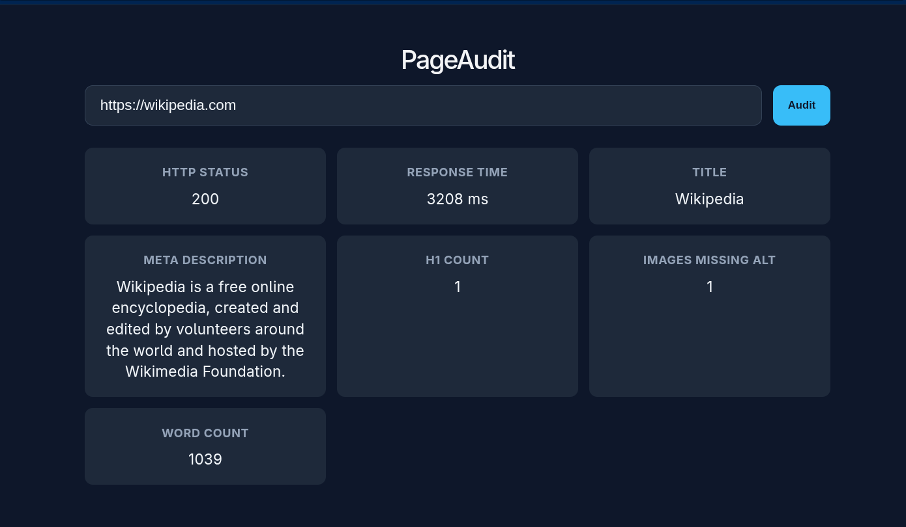

# PageAudit

A full-stack tool that audits any public URL for basic SEO and quality signals:
HTTP status, response time, page title, meta description, H1 count, images
missing `alt` text, and approximate word count.

**Live demo:** https://pageaudit.vercel.app
**API:** https://pageaudit-api.onrender.com




## Tech Stack

- **Client:** React 19, Vite, plain CSS (mobile-first, responsive grid)
- **Server:** Node.js, Express, Cheerio (HTML parsing), Axios
- **Testing:** Jest, Supertest
- **CI:** GitHub Actions

## Setup

```bash
git clone https://github.com/NikharAsthana/PageAudit.git
cd pageaudit

# server env
cp server/.env.example server/.env

# client env
cp client/.env.example client/.env

# install everything
npm install
cd server && npm install && cd ..
cd client && npm install && cd ..

# run both dev servers
npm run dev
```

Client: http://localhost:5173 · Server: http://localhost:5000

## API Contract

### `POST /api/audit`

**Request**
```json
{ "url": "https://example.com" }
```

**Response — 200 OK**
```json
{
  "data": {
    "url": "https://example.com/",
    "httpStatus": 200,
    "responseTimeMs": 312,
    "title": "Example Domain",
    "metaDescription": null,
    "h1Count": 1,
    "missingAltCount": 0,
    "wordCount": 28
  }
}
```

**Response — error shape (400 / 408 / 422 / 502)**
```json
{ "error": { "message": "The provided URL is not valid." } }
```

| Status | Meaning                                        |
|--------|-------------------------------------------------|
| 400    | Malformed request or invalid URL                |
| 408    | Target site timed out                           |
| 422    | Target responded with non-HTML content          |
| 502    | Target site unreachable                         |
| 500    | Unexpected server error                         |

## Design Decisions

1. **HTML parsing happens server-side, not in the browser.**
   Fetching an arbitrary third-party URL from the browser would be blocked
   by that site's CORS policy in most cases, and would expose the user's IP
   directly to whatever URL they type in. Doing the fetch server-side avoids
   both problems and lets us enforce a request timeout and rate limit in one
   place.

2. **The parsing logic is a pure function, separate from Express.**
   `auditService.js` takes a URL string and returns a plain object — it
   has no idea Express exists. This makes it trivially unit-testable
   (see `auditService.test.js`) without spinning up an HTTP server, and
   keeps business logic reusable if this were ever exposed via a CLI or
   a different transport.

3. **A custom error class hierarchy drives HTTP status mapping.**
   Instead of a large if/else chain in the controller, each failure mode
   (`InvalidUrlError`, `NonHtmlError`, `FetchTimeoutError`,
   `UpstreamUnreachableError`) is a typed `AppError` subclass carrying its
   own status code. A single error-handling middleware maps any thrown
   error to a consistent `{ error: { message } }` response shape, so every
   endpoint we add in the future automatically gets the same error contract
   for free.

## Running Tests

```bash
cd server
npm test
```